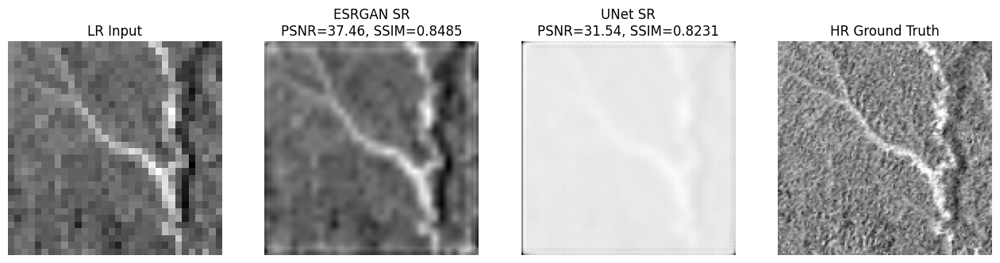
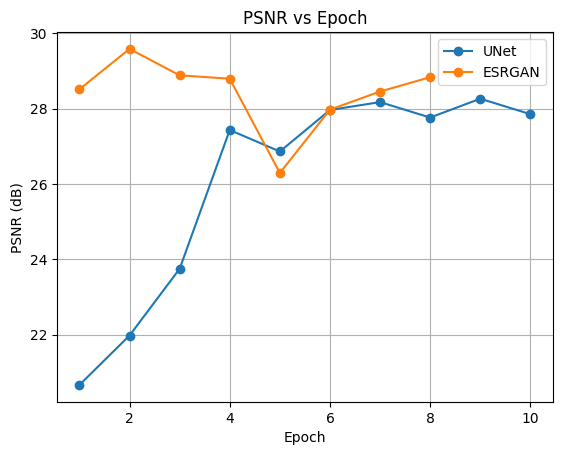
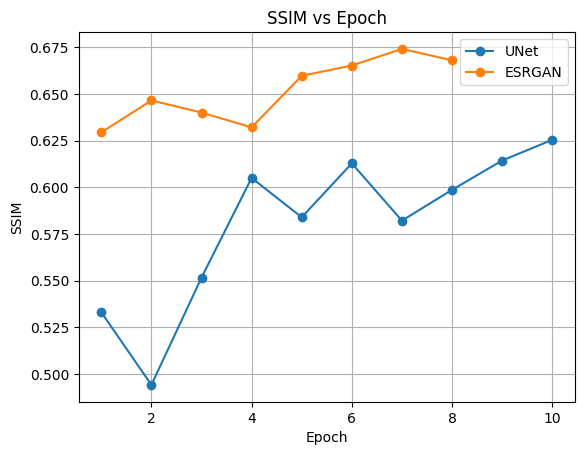
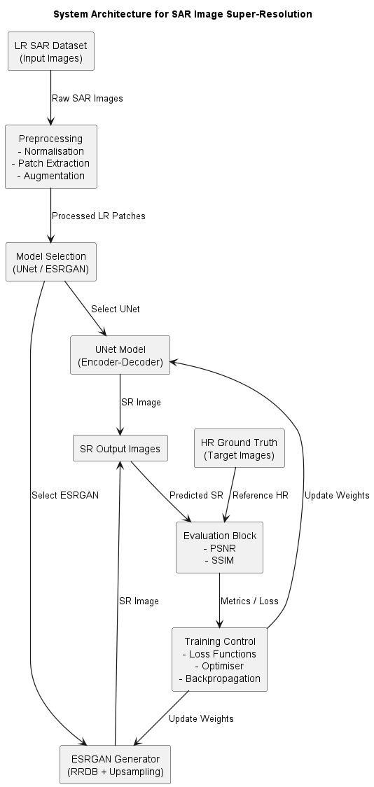
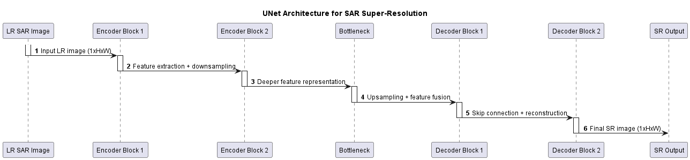
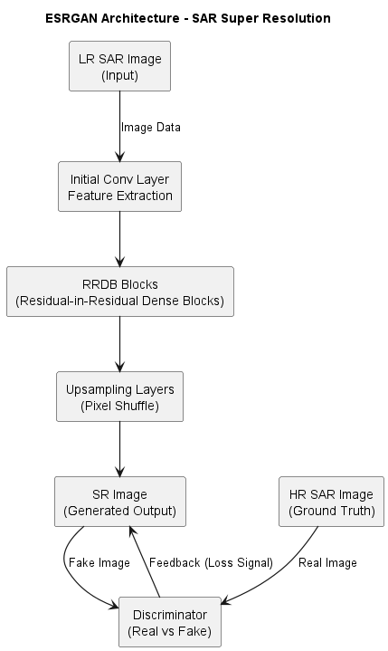

# SAR Image Super-Resolution with UNet and ESRGAN

Deep learning models that turn low-resolution **Synthetic Aperture Radar (SAR)** images into 4× higher-resolution images while suppressing speckle noise. The project compares two approaches: a **UNet** trained for pixel-accurate reconstruction and an **ESRGAN** trained adversarially for sharper, more realistic texture.

> Term project for **DIL700** in the M.Sc. programme in AI and Automation at University West, Sweden (2026). Group project. See [Team](#team).



## Why this matters

SAR works through clouds and at night, which makes it essential for monitoring rainforests, floods and land use. Its images are noisy (speckle) and relatively coarse, though. Super-resolution recovers finer detail from existing imagery without new sensors.

## Results

Test-set results after the second training iteration (×4 upscaling, 128×128 patches):

| Model  | PSNR (dB) | SSIM   | Character of output |
|--------|-----------|--------|---------------------|
| UNet   | 30.10     | 0.7205 | Stable, structurally consistent, slightly smooth |
| ESRGAN | **39.64** | **0.7888** | Sharper texture, better visual fidelity |

<p float="left">
  
  
</p>

**Takeaway:** UNet gives a reliable, stable baseline. ESRGAN, combining adversarial and content losses with SAR-specific augmentation, reconstructs noticeably finer detail. This illustrates the classic trade-off between pixel-wise accuracy and perceptual quality in super-resolution.

## Approach



**Data.** 66 GeoTIFF mosaics from the [JERS-1 SAR Global Rain Forest Mapping Project](https://doi.org/10.3334/ORNLDAAC/1280) (L-band, ~100 m resolution, Amazon Basin, 1995–1996).

**Preprocessing and augmentation**
- Log transform and 1st–99th percentile normalisation to tame SAR's huge dynamic range
- Random patch extraction (multiple patches per image) with fixed train/val/test splits
- Flips and 90° rotations
- Low-resolution inputs created by bicubic downsampling with anti-aliasing
- Synthetic **multiplicative speckle noise** on inputs, so the model learns despeckling and super-resolution together

**Models**

| UNet | ESRGAN |
|------|--------|
| Bilinear ×4 upsampling, then a 4-level encoder–decoder with skip connections and transposed-conv decoding; Charbonnier loss; mixed-precision training | Generator with Residual-in-Residual Dense Blocks and multi-scale feature fusion; patch discriminator; relativistic (RaGAN) adversarial loss + weighted content/gradient loss + TV regularisation; 5-epoch content-only warm-up, gradient clipping, LR scheduling |
|  |  |

**Evaluation.** PSNR, SSIM, training curves and side-by-side visual comparison against ground truth.

## Repository structure

```
├── notebooks/
│   └── sar_super_resolution.ipynb   # data pipeline, both models, training, evaluation
├── report/
│   ├── SAR_super_resolution_report.pdf   # full IEEE-style project report
│   ├── term_project.tex, references.bib  # LaTeX source
│   └── figures/
├── docs/images/                     # figures used in this README
├── data/sample/                     # one small sample mosaic (full dataset not included)
└── requirements.txt
```

## Getting started

```bash
git clone https://github.com/shumail9012/sar-super-resolution.git
cd sar-super-resolution
pip install -r requirements.txt
```

1. Download the JERS-1 100 m mosaics from the [ORNL DAAC](https://doi.org/10.3334/ORNLDAAC/1280) (≈1.8 GB) and place the `.tif` files in `data/`. To try the pipeline quickly, you can point it at `data/sample/`.
2. Open `notebooks/sar_super_resolution.ipynb` and set `dataset_dir` to your data folder (the notebook was originally run on Kaggle, so it points to `/kaggle/input/...`).
3. Run the cells in order. A CUDA GPU is strongly recommended.

## Tech stack

Python · PyTorch · torchmetrics · rasterio · scikit-image · NumPy · Matplotlib

## Team

This was a two-person group project.

| | Main responsibilities |
|---|---|
| **Shumail Alam Khan** | UNet baseline and its improvements, UNet literature review, requirements analysis, result consolidation and comparison, technical review of the report |
| **Suraj Karki** ([@suka1901](https://github.com/suka1901)) | ESRGAN model and GAN training pipeline, system engineering, experimental results, LaTeX and GitHub integration |

Both members took part in the evaluation. The original group repository is [suka1901/Term_project](https://github.com/suka1901/Term_project). The contribution breakdown above follows the one in the project report.

## References

- B. Chapman, A. Rosenqvist, A. Wong, *JERS-1 Synthetic Aperture Radar, 100-m Mosaics, South America: 1995–1996*, ORNL DAAC, 2015. doi:[10.3334/ORNLDAAC/1280](https://doi.org/10.3334/ORNLDAAC/1280)
- *S3-ESRGAN: Enhanced Super-Resolution GAN for Remote Sensing Imagery Spatial Resolution Improvement*, IEEE JSTARS, 2025. doi:[10.1109/JSTARS.2025.3640940](https://doi.org/10.1109/JSTARS.2025.3640940)
- The full reference list is in the [report](report/SAR_super_resolution_report.pdf).
